# 2025-01-13 Write Up

## 今日主题关键词

新手, MISC, 签到

## 今日题目

- [x] 10金币 [LitCTF 2023]404notfound (初级) https://www.nssctf.cn/problem/3881
- [x] 10金币 [LitCTF 2023]What_1s_BASE (初级) https://www.nssctf.cn/problem/3879
- [x] 20金币 [HDCTF 2023]hardMisc https://www.nssctf.cn/problem/3796
- [x] 10金币 [LitCTF 2023]Hex？Hex！(初级)  https://www.nssctf.cn/problem/3887
- [x] 10金币 [LitCTF 2023]Is this only base?  https://www.nssctf.cn/problem/3968
- [x] 10金币 [LitCTF 2023]就当无事发生 https://www.nssctf.cn/problem/3862

## 训练WP:

## 1. [LitCTF 2023]404notfound (初级)

- 题目名称: [LitCTF 2023]404notfound (初级)
- 题目链接: https://www.nssctf.cn/problem/3881
- 考点清单: 图片隐写
- 工具清单: 010 Editor

### 1.1 查看题目

题目描述：

> 怎么又是404！还好是图片不是页面（呼~）

附件是一个 `png` 文件，打开如下：

看上去图片本身无有效信息。

### 1.2 解题思路

首先考虑图片隐写，用 `010 Editor` 打开，先快速看一下开头和结尾，好像没有什么问题，考虑中间部分有有效信息。

搜索 `LitCTF` ,查看搜索结果如下：

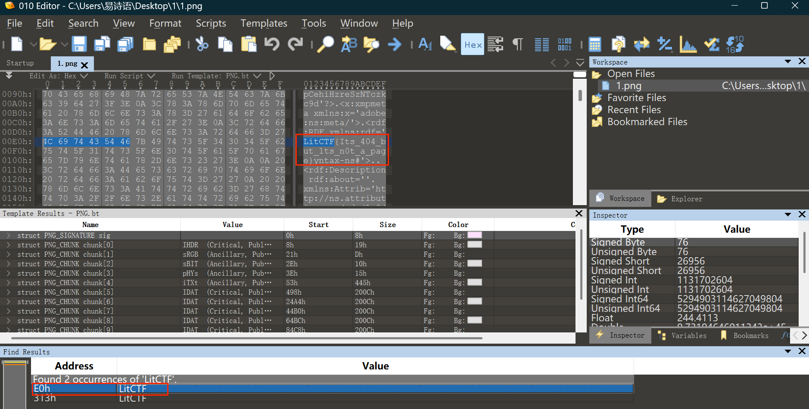

找对应位置，直接可得flag：

`LitCTF{Its_404_but_1ts_n0t_a_page}`

## 2. [LitCTF 2023]What_1s_BASE (初级)

- 题目名称: [LitCTF 2023]What_1s_BASE (初级)
- 题目链接: https://www.nssctf.cn/problem/3879
- 考点清单: base64编码
- 工具清单: CyberChef

### 2.1 查看题目

题目描述：

> base星期四！！

附件为 `txt` 文件，直接打开：

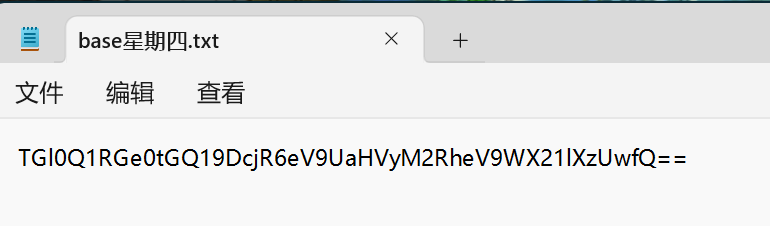

### 2.2 解题思路
观察形式，应该是 base64 加密，直接使用 `CyberChef` 解密：

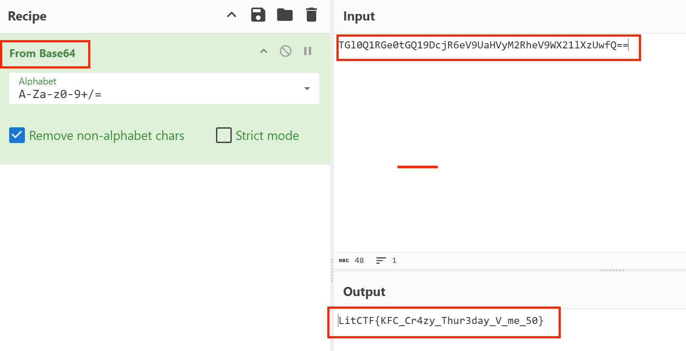

获得flag:

`LitCTF{KFC_Cr4zy_Thur3day_V_me_50}`

## 3. [HDCTF 2023]hardMisc 

- 题目名称: [HDCTF 2023]hardMisc 
- 题目链接: https://www.nssctf.cn/problem/3796
- 考点清单: 图片隐写；base64编码
- 工具清单: 010 Editor；CyberChef

### 3.1 查看题目

题目描述：

> can can need flag

附件为 `png` 文件，打开如下：

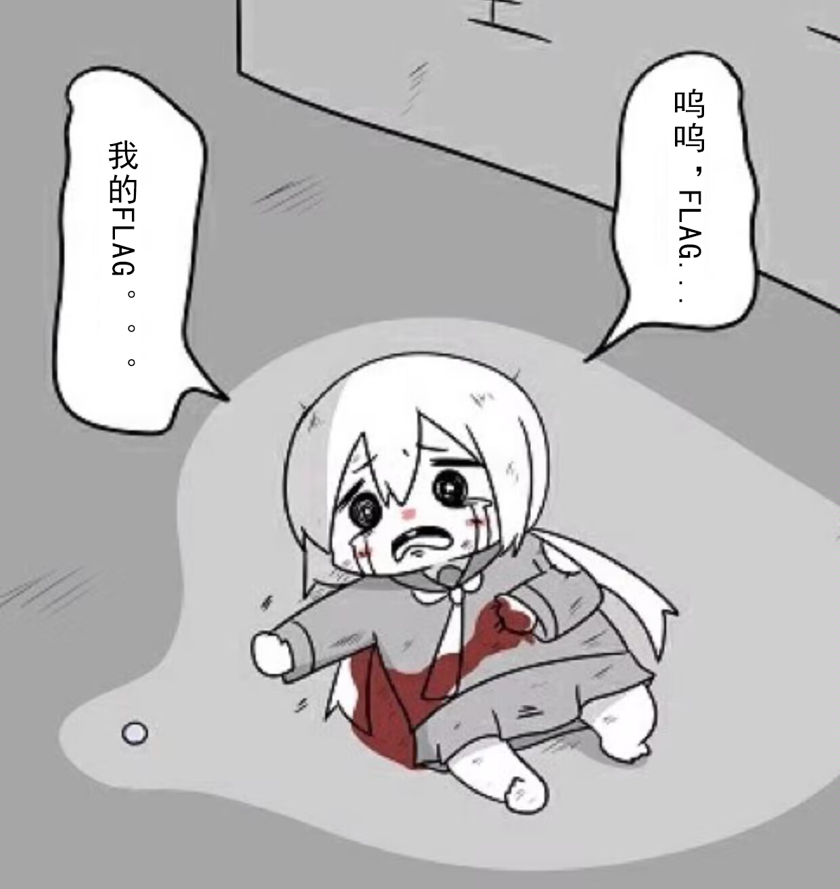

同样，图片看起来也没有什么信息。

### 3.2 解题思路

同样首先考虑图片隐写，用 `010 Editor` 打开，快速看一下开头和结尾，在最后发现一点端倪：

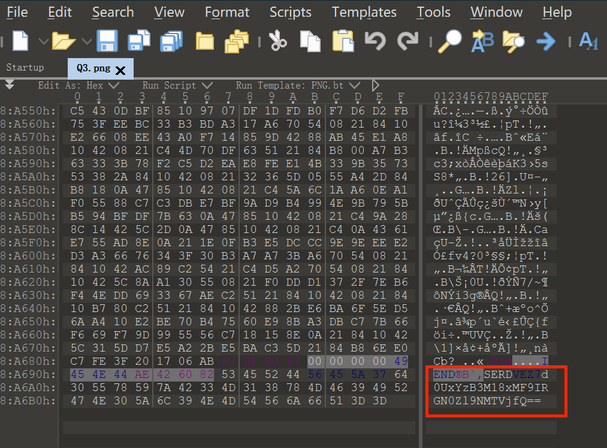

多出来一段：

`SERDVEZ7d0UxYzB3M18xMF9IRGN0Zl9NMTVjfQ==`

看形式多出来的这段应该是 base64 编码。
把这段直接放进 `CyberChef` 里解码：

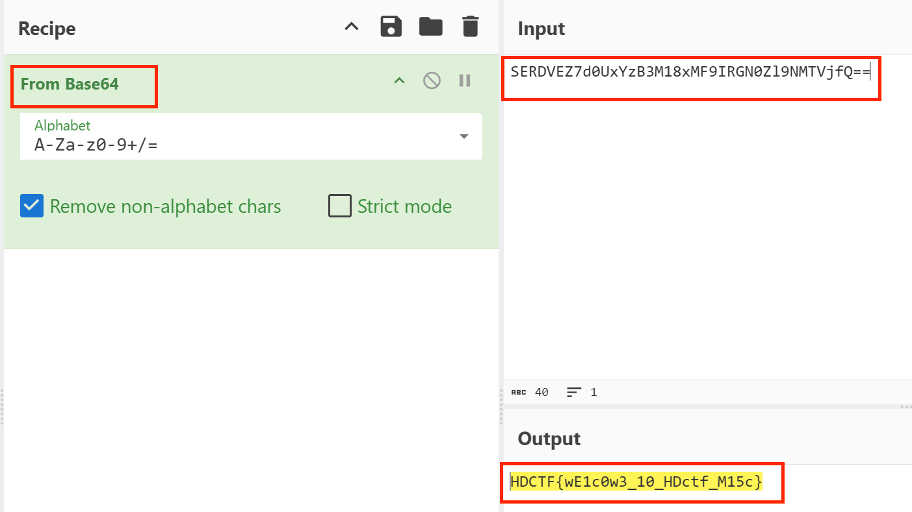

即可获得flag：

`HDCTF{wE1c0w3_10_HDctf_M15c}`

## 4. [LitCTF 2023]Hex？Hex！(初级) 

- 题目名称: [LitCTF 2023]Hex？Hex！(初级) 
- 题目链接: https://www.nssctf.cn/problem/3887
- 考点清单: Hex 转换
- 工具清单: CyberChef

### 4.1 查看题目

题目描述：

> 如果你也和我一样知道hex的话，那我觉得，这件事，太酷啦！

附件为 `txt` 文件，打开如下：

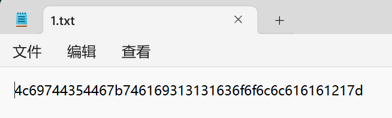

### 4.2 解题思路

一看题目和 `txt` 文件（以及“初级”两个字），最直接的做法就是放进 `CyberChef` 里进行 Hex 转换：

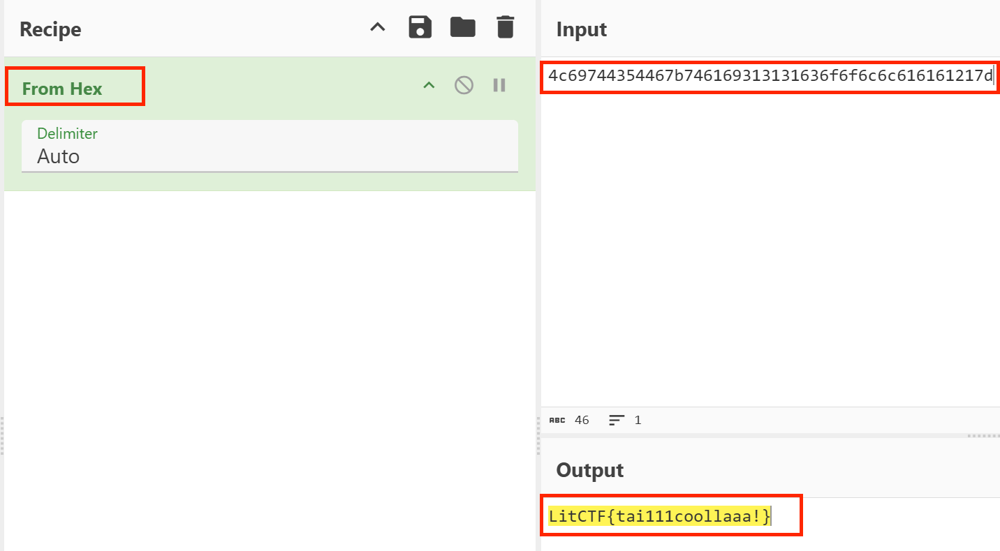

直接就得到flag：

`LitCTF{tai111coollaaa!}`

## 5. [LitCTF 2023]Is this only base? 

- 题目名称: [LitCTF 2023]Is this only base? 
- 题目链接: https://www.nssctf.cn/problem/3968
- 考点清单: 栅栏密码；base64编码；凯撒密码
- 工具清单: CyberChef

### 5.1 查看题目

题目描述：无

附件为 `txt` 文件，打开如下：

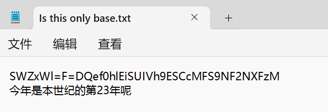

分成了两行，第一行应该是需要我们解码的，第二行应该是一个提示。

提示关键是数字 `23` ，那多半 `23` 是某种加解密方式的 key 了。

### 5.2 解题思路

观察形式，由两个“ = ”想到 base64 编码，但“ = ”的位置不对，不在最后。

所以大致成因就是，先进行了 base64 加密，再用某种方式加密，且该种方式造成了移位。

脑子空空于是搜了有哪些移位密码（嗯已经忘了...），结果如下：

> 古典密码当中的移位密码在ctf比赛当中最主要出现三种形式，其中的k有的是固定的，有的是自定义的（需要爆破）。

> 固定的是云影密码，自定义的是曲路密码和栅栏密码。其中曲路密码的k的爆破主要是针对行列数的改变和遍历方向的不同。而栅栏密码爆破则主要针对的是k的数值不同。

在CyberChef中尝试，置 `k = 23` ，发现栅栏密码解密可以得到 base64 形式的字符串：

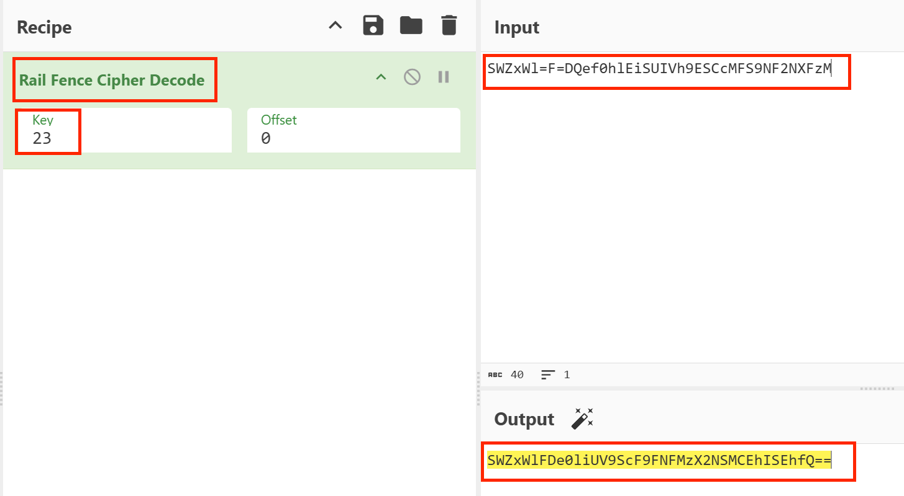

结果：`SWZxWlFDe0liUV9ScF9FNFMzX2NSMCEhISEhfQ==`

将结果继续进行 base64 解码：

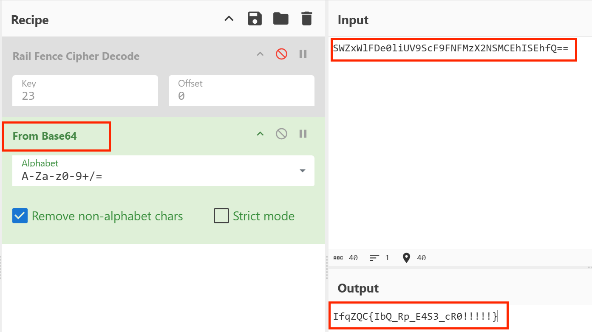

结果：`IfqZQC{IbQ_Rp_E4S3_cR0!!!!!}`

看结果，像flag的结构了。因为结构是一定的，于是考虑替换密码。

再仔细观察，前6个字符大小写和所需flag的前缀 `LitCTF` 一致，再推算一下，应该是所有字母前移3位所得。

脑子空空但还是记得原理对应的是凯撒密码，在 `CyberChef` 中继续解，设置移动量为3：

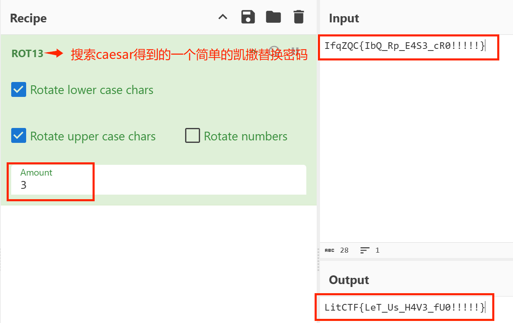

结果即为flag：

`LitCTF{LeT_Us_H4V3_fU0!!!!!}`

## 6. [LitCTF 2023]就当无事发生 

- 题目名称: [LitCTF 2023]就当无事发生 
- 题目链接: https://www.nssctf.cn/problem/3862
- 考点清单: .git泄露；信息收集

### 6.1 查看题目

题目描述：

> https://ProbiusOfficial.github.io
> 差点数据没脱敏就发出去了，还好还没来得及部署，重新再pull一次（x
> Flag形式 NSSCTF{}

无附件，题目描述里的链接：
https://ProbiusOfficial.github.io

点进去一看，是一个用 Github Action 搭建的博客，首页长这样：

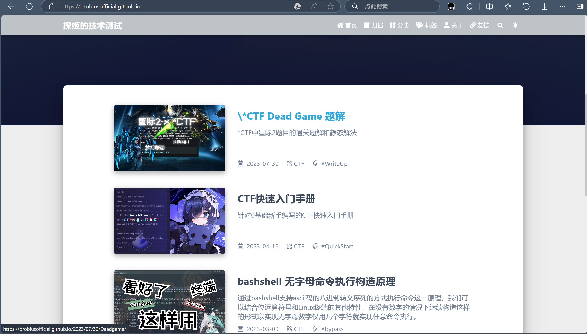

本人心情：......

我点过去点过来查看所有内容，想了很久也没有思路，感觉和内容没有关系，但是又不知道从哪里下手。

遂查看别人的题解（放弃了吗放弃了吧），跟着做下来。

#### 6.2 （跟着别人做的）解题过程

在关于页找到 Github 地址：

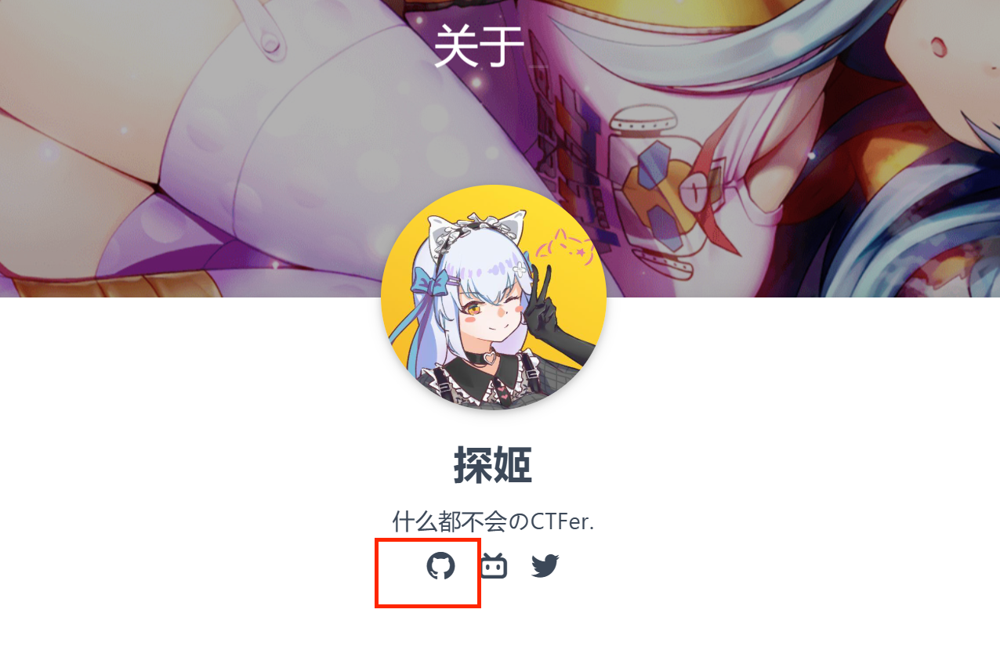

地址：https://probiusofficial.github.io/about/

找到仓库，查看commit记录：

https://github.com/ProbiusOfficial/ProbiusOfficial.github.io/commits/main/

一条一条查看，最后找到这一条：

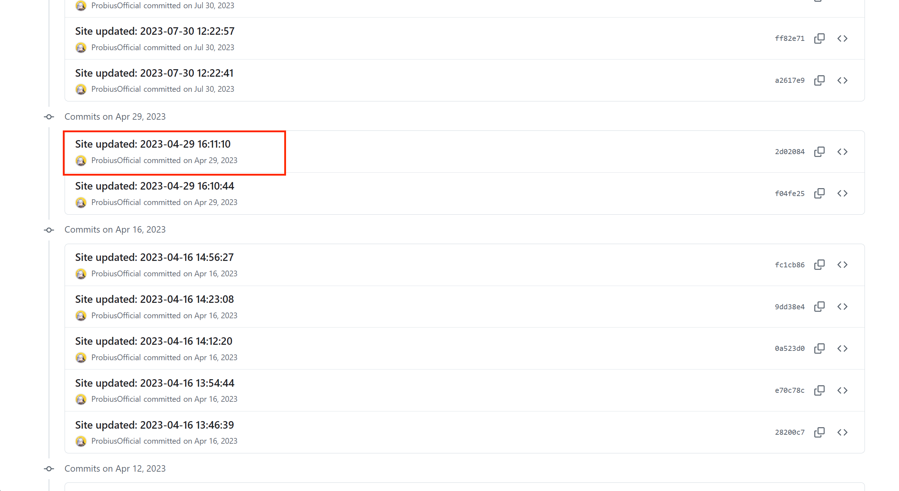

地址：
https://github.com/ProbiusOfficial/ProbiusOfficial.github.io/commit/2d02084c5aa044d5dae3fc02a2a70248ab5500b5

查看内容，在中间部分找到flag：

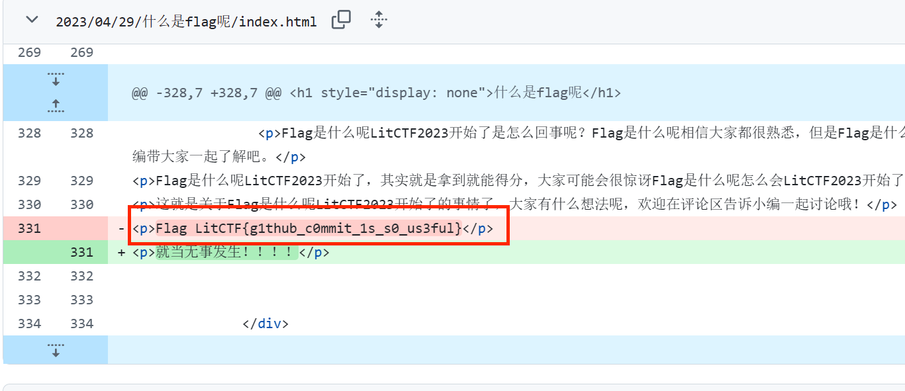

得到flag：

`LitCTF{g1thub_c0mmit_1s_s0_us3ful}`
