# 2025-01-15 Write Up

## 今日主题关键词

进阶, MISC, Programming

## 今日题目

- [x] 10金币 [MoeCTF 2022]寻找黑客的家 https://www.nssctf.cn/problem/3314
- [x] 10金币 [MoeCTF 2022]zip套娃 https://www.nssctf.cn/problem/3313
- [x] 20金币 [FSCTF 2023]最终试炼hhh https://www.nssctf.cn/problem/4601
- [x] 10金币 [网鼎杯 2022 玄武组]misc999 https://www.nssctf.cn/problem/2572
- [x] 10金币 [SDCTF 2022]Case64AR https://www.nssctf.cn/problem/2378


## 训练WP:

## 1. [MoeCTF 2022]寻找黑客的家 

- 题目名称: [MoeCTF 2022]寻找黑客的家
- 题目链接: https://www.nssctf.cn/problem/3314
- 考点清单: OSINT；信息收集

### 1.1 查看题目

题目描述：

> 大黑客Mikato期末结束就迫不及待的回了家，并在朋友圈发出了“这次我最早”的感叹。那么你能从这条朋友圈找到他的位置吗？

附件是两张图片，打开如下：


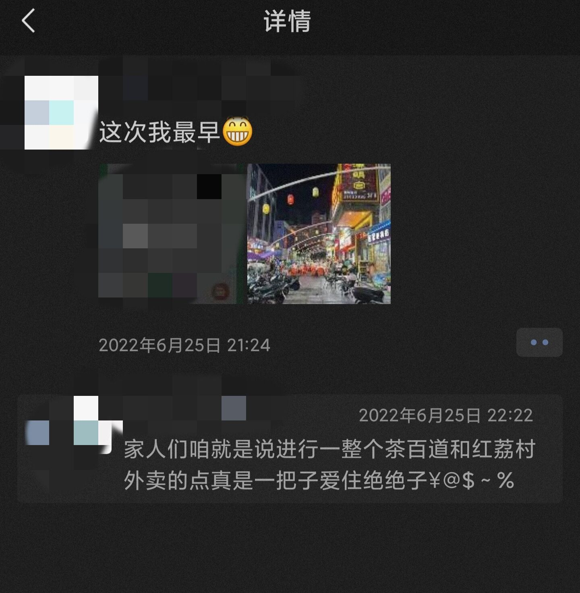


### 1.2 解题思路

先是直接把图1扔进谷歌图片里搜素了一下，但是没有得到多少有效信息，因为相似的街景布景太多了。

再看图1，最显眼的是“汉明宫”招牌，于是直接在高德地图搜索“汉明宫”，得到几个结果，查看店家图片，对比信息可知是以下这家店：

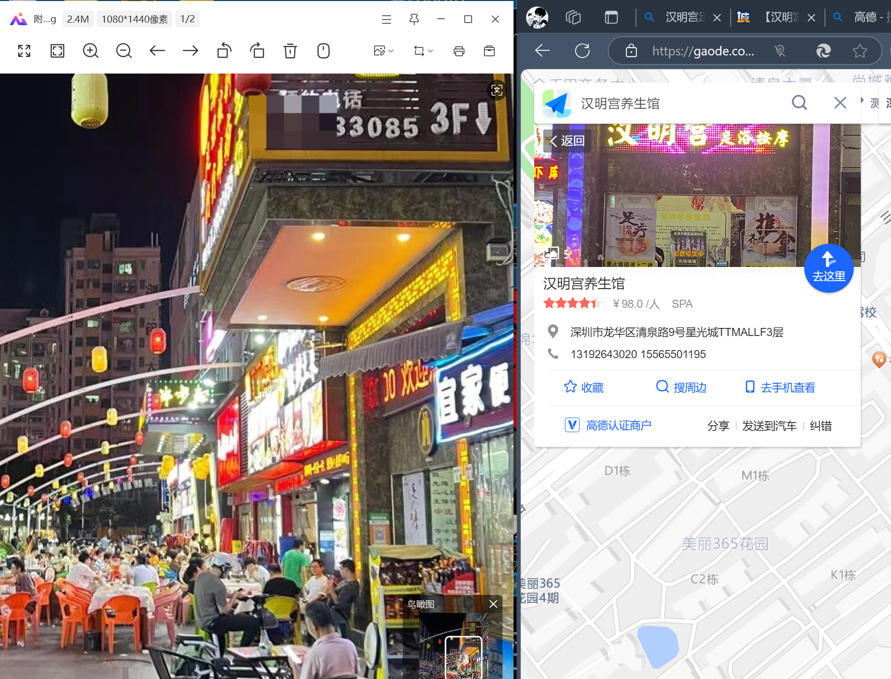

地址信息很详细，深圳市龙华区清泉路，可得 flag ：

`NSSCTF{shenzhen_longhua_qingquan}`


## 2. [MoeCTF 2022]zip套娃 

- 题目名称: [MoeCTF 2022]zip套娃 
- 题目链接: https://www.nssctf.cn/problem/3313
- 考点清单: 密码爆破；掩码攻击；伪加密
- 工具清单: ARCHPR；010 Editor

### 2.1 查看题目

题目描述：

> zip套娃娃娃

附件为一个名为 `f.zip` 的压缩包。


### 2.2 解题思路

首先尝试直接打开压缩包 `f.zip` ，发现需要密码。

由于没有其他提示，所以先直接用 `ARCHPR` 暴力爆破：

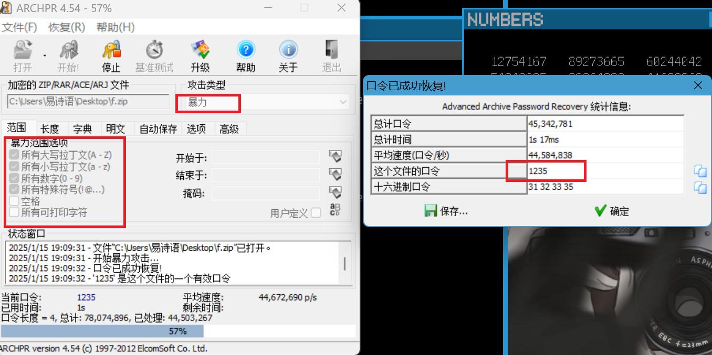

暴力范围选大一点，可以直接获得解压密码：`1235` 。

用密码解压，获得第二个压缩包 `fl.zip` 和一个 `密码.txt` 的文件。同样，压缩包需要密码解压。

查看 `txt` 文件，获得密码提示：

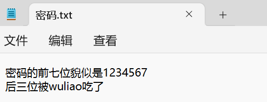

给了我们密码的前七位和总位数，因此用掩码攻击，掩码置为 `1234567???` ：

（我试了一下，暴力爆破是不行的。）

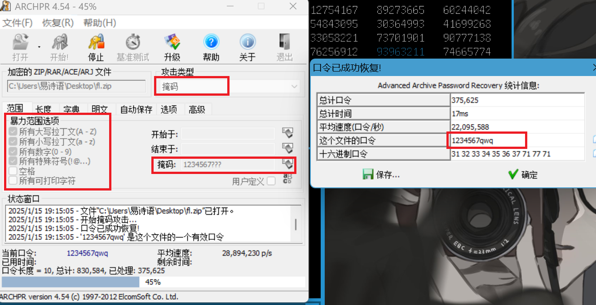

获得第三个压缩包 `fla.zip` ,也提示需要密码解压。

这次用 `ARCHPR` 爆破不了了，考虑伪加密。

*(关于 zip 伪加密参考：https://blog.csdn.net/qq_32350719/article/details/102661596)*

用 `010 Editor` 打开压缩包查看，发现压缩源文件数据区压缩源文件全局方式位标记为0（即无加密），目录区全局方式位标记不为0，两者不一致。

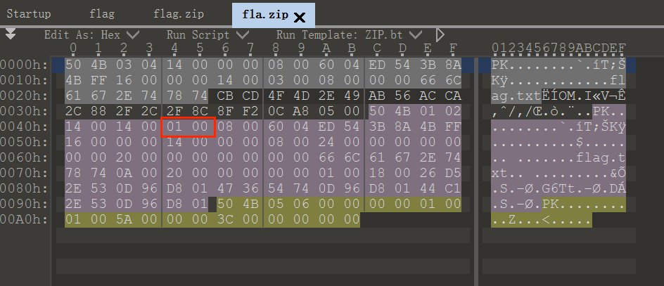

将图示 `01` 改成 `00`，即可恢复显示无加密，可直接解压。

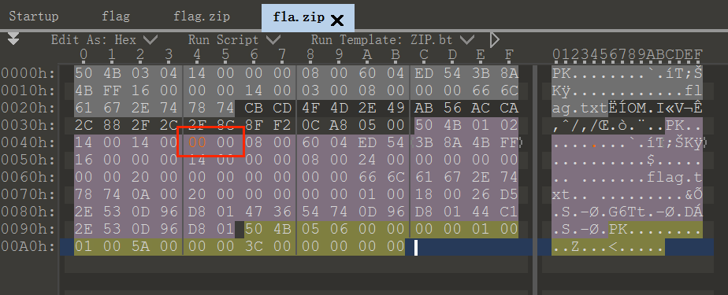

解压后获得最终的 `txt` 文件，打开即为 flag ：

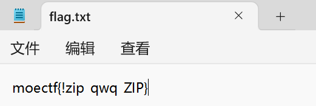

获得 flag :

`moectf{!zip_qwq_ZIP}`


## 3. [FSCTF 2023]最终试炼hhh 

- 题目名称: [FSCTF 2023]最终试炼hhh 
- 题目链接: https://www.nssctf.cn/problem/4601
- 考点清单: 压缩包分析；伪加密；PDF隐写
- 工具清单: 010 Editor；wbStego4.3open

### 3.1 查看题目

题目描述：

> 李华早起发现现在居然是黑天！

附件为名为 `flag` 的一个未知文件。


### 3.2 解题思路

用 `010 Editor` 打开文件，快速查看一下开头，发现开头没有应有的文件头，第一反应是文件头缺失。

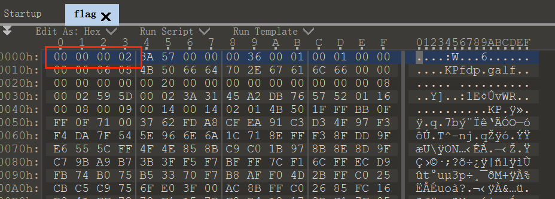

接着看一下结尾，看到熟悉的 `50` `4B` ，意识到应该是被逆置了。把所有内容复制下来，然后逆置回去就好了。 

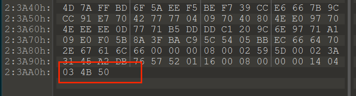

OK然后我在这里狠狠卡了一下，因为找了会儿发现没有马上能用的逆置工具，遂面向GPT编程，但是调试了好一会儿都没成功，已经浪费了很多时间了，所以气急败坏地直接拿 xl 的代码用了（x

代码如下：

```python
input = open('flag', 'rb')
input_all = input.read()
ss = input_all[::-1]
output = open('flag.zip', 'wb')
output.write(ss)
input.close()
output.close()
```

运行代码，可以获得一个 `flag.zip` 文件。

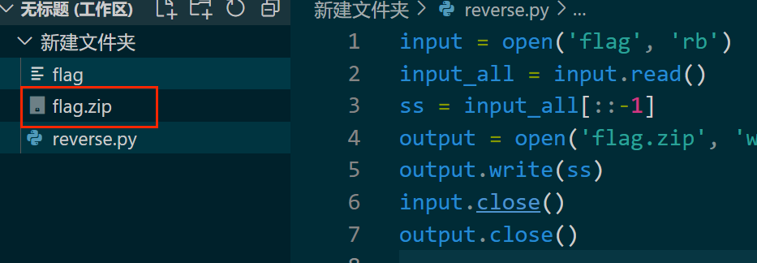

尝试直接解压，发现需要密码。用 `010 Editor` 打开查看，OK又是一个伪加密，和上题一样找到修改段，将 `09` 修改为 `00` 。

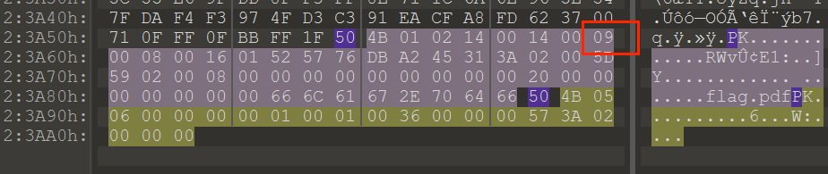

保存好退出，直接解压即可，获得一个 `flag.pdf` 文件。打开是一堆这样的无用信息：

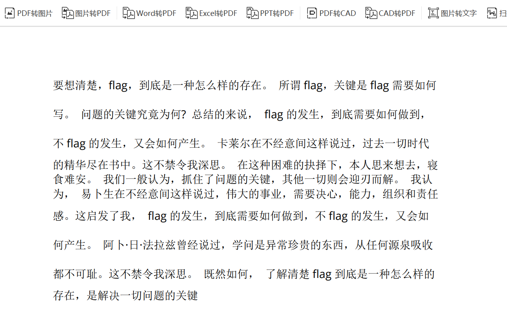 

好的又被摆了一道，内容是无用的，看题目标签应该是 pdf 隐写了。

查了一下，需要用隐写工具反隐写。感谢 xl 让我不用再单独去找工具，直接从xl那里获得了隐写工具 `wbStego4.3open` 。

按步骤使用 `wbStego4.3open` ，获得一个 `txt` 文件，打开即为 flag ：

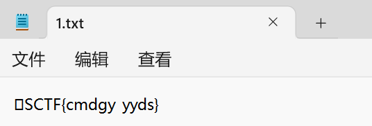

最终 flag ：

`FSCTF{cmdgy_yyds}`


## 4. [网鼎杯 2022 玄武组]misc999 

- 题目名称: [网鼎杯 2022 玄武组]misc999 
- 题目链接: https://www.nssctf.cn/problem/2572
- 考点清单: 字符编码；base-n
- 工具清单: vscode

### 4.1 查看题目

题目描述：

> base

附件为 `txt` 文件，打开如下：

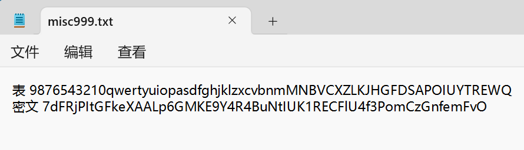

分为上下两个部分，表和密文。

### 4.2 解题思路

根据题目描述和文件内容，判断应该是 `base-n`编码的换表版。再看表内容，62个字符，确定是 `base 62` 。

然后编程实现 `base 62` 原理的换表编码就好，代码如下：

```python

def base62_decode_to_string(encoded_string):
    base62_table = "9876543210qwertyuiopasdfghjklzxcvbnmMNBVCXZLKJHGFDSAPOIUYTREWQ"
    base = len(base62_table)
    char_to_value = {char: index for index, char in enumerate(base62_table)}
    
    # 将 Base62 解码为数字
    decoded_value = 0
    for char in encoded_string:
        if char not in char_to_value:
            raise ValueError(f"Invalid character '{char}' in encoded string.")
        decoded_value = decoded_value * base + char_to_value[char]
    
    # 数字转换回字符串
    decoded_string = ""
    while decoded_value > 0:
        decoded_string = chr(decoded_value % 256) + decoded_string
        decoded_value //= 256
    
    return decoded_string

# 使用
encoded_string = "7dFRjPItGFkeXAALp6GMKE9Y4R4BuNtIUK1RECFlU4f3PomCzGnfemFvO"
decoded_string = base62_decode_to_string(encoded_string)
print(f"Decoded string: {decoded_string}")
```

运行代码得到：

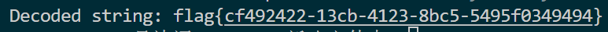

直接可得 flag ：

`flag{cf492422-13cb-4123-8bc5-5495f0349494}`


## 5. [SDCTF 2022]Case64AR 

- 题目名称: [SDCTF 2022]Case64AR 
- 题目链接: https://www.nssctf.cn/problem/2378
- 考点清单: base-n；凯撒密码；编码分析
- 工具清单: CyberChef

### 5.1 查看题目

题目描述：

> Someone script kiddie just invented a new encryption scheme. It is described as a blend of modern and ancient cryptographic techniques. Can you prove that the encryption scheme is insecure by decoding the ciphertext below?
>
> Ciphertext: OoDVP4LtFm7lKnHk+JDrJo2jNZDROl/1HH77H5Xv

> 某个脚本小子刚刚发明了一种新的加密方案。它被描述为现代和古代加密技术的混合体。你能通过解码下面的密文来证明该加密方案不安全吗？
>
>密文：OoDVP4LtFm7lKnHk+JDrJo2jNZDROl/1HH77H5Xv

无附件。


### 5.2 解题思路

这道题通过题目名和描述可以推测出，加密使用了凯撒密码和 `base-n` 的结合。另外，根据密文里的 `+` 和 `/` 字符可以推测使用的是 `base 64` 。

先直接 `base 64` 解码看了一下，果然不行。最开始想的是先进行 `base 64` 编码，再用凯撒密码替换。题目并未给提示，未知 k 为多少，可以编程一个一个试，但是我试了感觉结果不对，应该不是这样结合的。又想换个顺序，先凯撒加密后进行 `base 64` ，试了很久结果也不如意。

想了挺久的，但脑子有限想不到了......所以查了题解。

我之前试的其实都算是按顺序加密，而不是两种加密方式的融合。查看两种加密方式的原理，在 `base64` 中，替换标准表时可以加入偏移量，也就是在这加入凯撒加密。可以穷举所有偏移量，寻找偏移量为几时可以成功打印出 flag 。

编程穷举，代码如下：

```python
import base64
b64 = "ABCDEFGHIJKLMNOPQRSTUVWXYZabcdefghijklmnopqrstuvwxyz0123456789+/="
qs = 'OoDVP4LtFm7lKnHk+JDrJo2jNZDROl/1HH77H5Xv'

for i in range(64):
    ans=""
    for c in qs:
        ans+=b64[(b64.index(c)+i)%64]
    try:
        a = base64.b64decode(ans).decode()
        print(a)
    except:
        print(end = '')
```

运行代码可得：

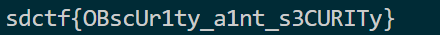

当然也可以一个一个试，偏移量为 `14` 时可以得到 flag ：

```python
import base64
b64 = "ABCDEFGHIJKLMNOPQRSTUVWXYZabcdefghijklmnopqrstuvwxyz0123456789+/="
qs = 'OoDVP4LtFm7lKnHk+JDrJo2jNZDROl/1HH77H5Xv'

#穷举，试到 i=14 时可以打印出flag
i = 14 
ans=""
for c in qs:
    ans+=b64[(b64.index(c)+i)%64]
try:
    a = base64.b64decode(ans).decode()
    print(a)
except:
    print(end = '')
```

获得 flag ：

`sdctf{OBscUr1ty_a1nt_s3CURITy}`
